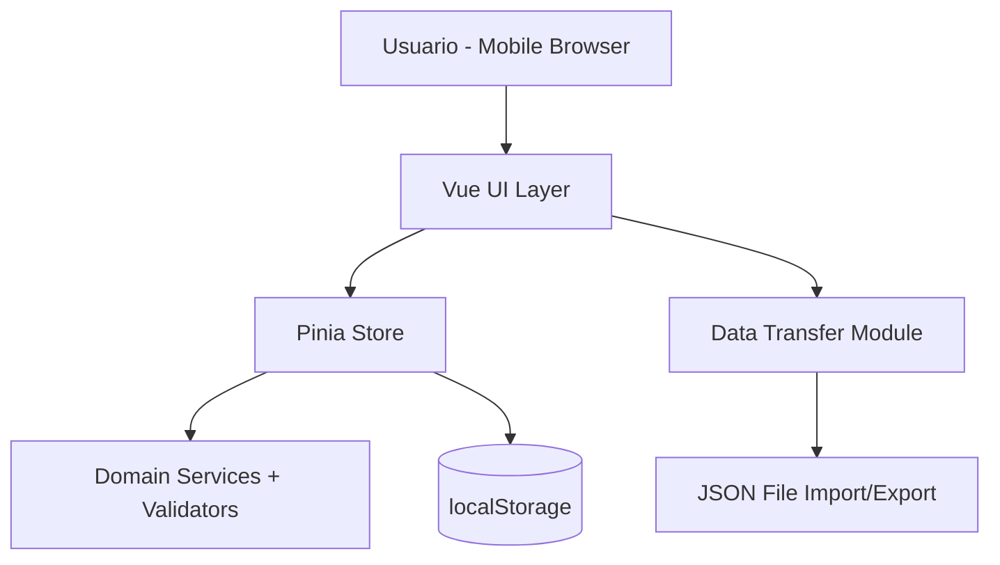
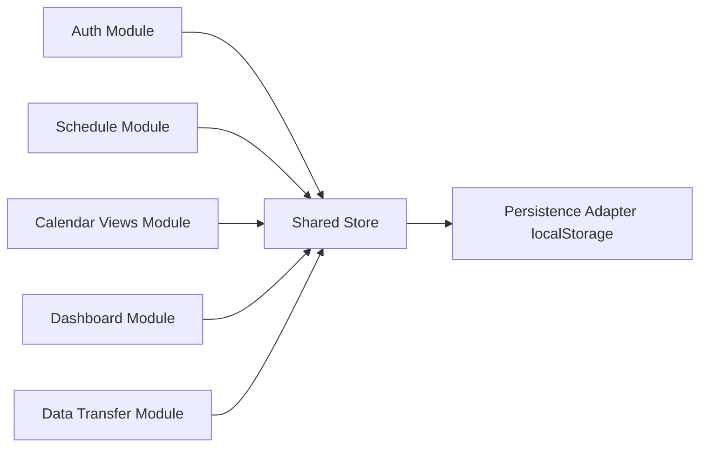
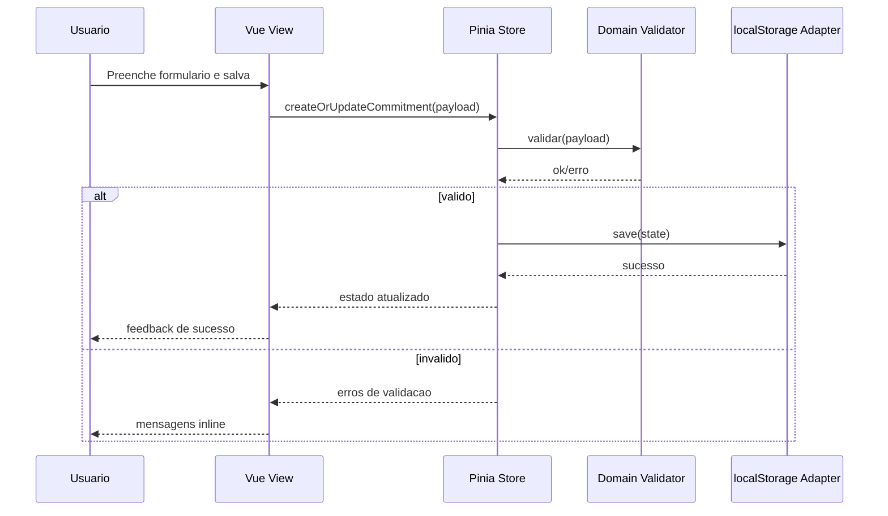
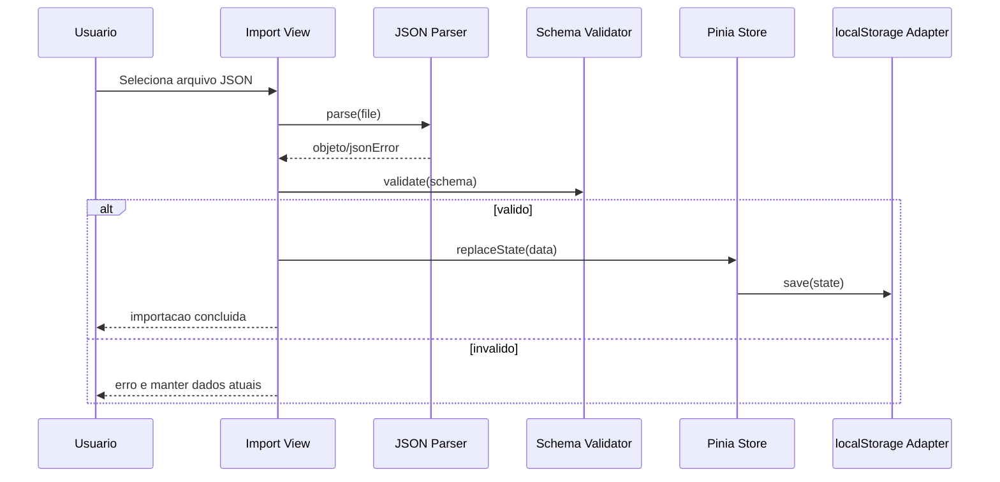

# Diagramas de Arquitetura

## Diagrama 1 - Visao geral do sistema

## Diagrama 2 - Componentes e responsabilidades

## Diagrama 3 - Fluxo de CRUD de compromisso

## Diagrama 4 - Fluxo de importacao JSON

